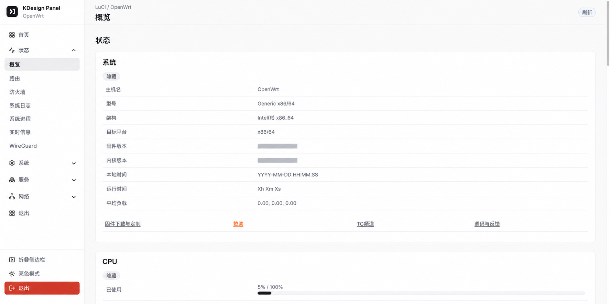
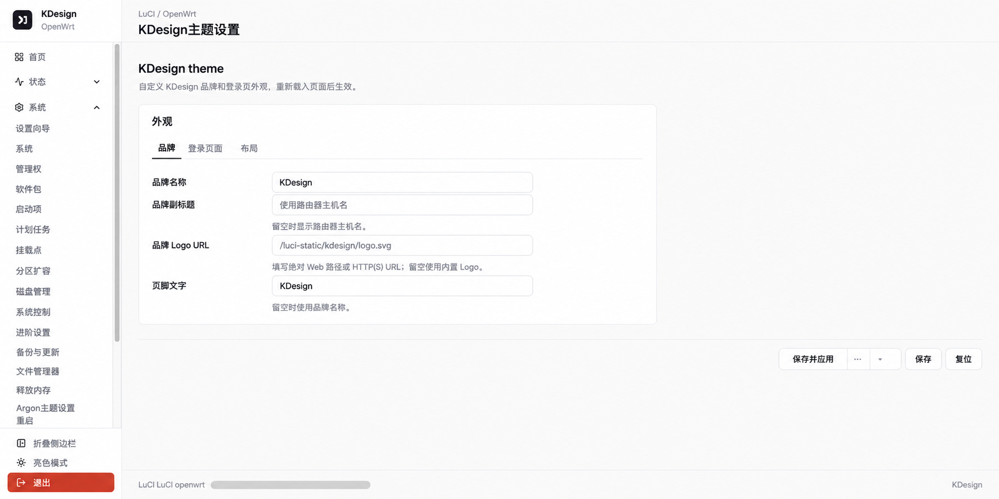

# KDesign LuCI 主题

KDesign 是一套面向 OpenWrt LuCI 的现代化响应式主题。它保留 LuCI 原有的路由、RPC、UCI、ubus、表单和应用行为，只替换页面外壳、导航方式与组件视觉样式。

## 功能特性

- 简洁、高信息密度的桌面端布局，并适配平板和手机
- 浅色、深色、跟随系统三种外观模式
- 桌面端侧栏折叠、分类抽屉和折叠状态下的悬浮二级菜单
- 重新设计的登录页、概览卡片、端口状态和网络状态
- 统一的表格、标签页、表单、按钮、弹窗、进度条和提示信息
- 针对网络、防火墙、DHCP/DNS、系统、备份与更新等常用 LuCI 页面进行布局适配
- 兼容 AdGuard Home、UPnP、动态 DNS、Samba4、SQM、Statistics 等常见插件页面
- 不依赖 CDN、远程字体或路由器端 Node.js 环境

## 界面截图

下列截图来自实际 Kwrt/OpenWrt 路由器环境，主机名、地址、固件标识和设备信息已脱敏。





## 配套设置插件

建议同时安装 [luci-app-kdesign](https://github.com/kindyear/luci-app-kdesign)。设置插件提供可视化配置页面，可修改品牌名称、Logo、登录页文案、登录背景、Bing 每日壁纸和侧栏默认状态。

主题可以独立运行；未安装设置插件时会继续使用内置默认值。

## 系统要求

运行环境：

- 带有 `luci-base` 和 ucode 模板支持的 OpenWrt/Kwrt
- 当前版本的 Chrome、Edge、Firefox 或 Safari

开发环境：

- Node.js 20 或更高版本
- pnpm 10 或更高版本

## 安装

从 GitHub Releases 下载与你的软件包管理器和架构匹配的构建产物，然后安装：

```sh
# opkg 系统
opkg install ./luci-theme-kdesign_*.ipk

# apk 系统
apk add --allow-untrusted ./luci-theme-kdesign-*.apk
```

安装后进入 **系统 → 系统 → 语言和界面**，将主题切换为 **KDesign**。安装过程不会强制替换当前主题。

如果同时使用设置插件，请继续安装：

- `luci-app-kdesign`
- `luci-i18n-kdesign-zh-cn`（简体中文界面）

## 本地构建

```sh
pnpm install --frozen-lockfile
pnpm build
pnpm check
```

生成的运行时文件位于：

```text
htdocs/luci-static/kdesign/cascade.css
htdocs/luci-static/kdesign/theme.js
htdocs/luci-static/kdesign/icons/
htdocs/luci-static/resources/menu-kdesign.js
```

`src/` 中的文件是源代码，请不要直接修改生成后的 CSS 和 JavaScript。

持续监听构建：

```sh
pnpm dev
```

生成适合放入 OpenWrt feed 的源码包：

```sh
pnpm package:source
```

输出文件为 `dist/luci-theme-kdesign-source.tar.gz`。

## OpenWrt SDK 构建

将仓库放入 `feeds/luci/themes/luci-theme-kdesign` 或其他 LuCI feed 主题目录，再通过 OpenWrt 正常构建系统选择 `luci-theme-kdesign`。

仓库内的 GitHub Actions 当前以 OpenWrt 24.10 x86_64 SDK 构建 IPK，用于兼容仍使用 opkg 的 Kwrt 25.12 x86/64 环境。普通推送到 `main` 会执行检查和构建；推送 `v*` 标签会自动创建 GitHub Release，并附带 IPK 与 `SHA256SUMS`。

示例：

```sh
git tag v0.1.0
git push origin v0.1.0
```

## 项目结构

- `src/styles/`：设计令牌、基础样式、布局、组件和页面适配
- `src/scripts/theme.js`：外观模式、侧栏状态与页面增强逻辑
- `src/scripts/menu-kdesign.js`：根据 LuCI 动态菜单树生成导航
- `ucode/template/themes/kdesign/`：主题外壳和登录模板
- `root/etc/uci-defaults/30_luci-theme-kdesign`：主题注册脚本

主题不会修改网络配置，也不会在前端直接写入 UCI 或调用业务类 ubus 接口。

## 已验证环境

- Kwrt 25.12-SNAPSHOT，x86/64，opkg
- LuCI ucode 模板
- 桌面端与移动端响应式布局
- 常用系统、网络、防火墙、DHCP/DNS 和第三方插件页面

不同 OpenWrt 分支、厂商固件及第三方插件可能包含自定义 DOM 结构，遇到兼容问题时请附带页面截图、LuCI 版本和对应插件名称提交 Issue。

## 卸载

请先切换到其他已安装主题，再执行：

```sh
opkg remove luci-theme-kdesign
# 或
apk del luci-theme-kdesign
```

## 许可证与致谢

本项目使用 Apache License 2.0。主题模板和菜单集成基于 OpenWrt LuCI Bootstrap 主题公开接口与结构实现；衍生代码保留上游版权信息。项目内的 Lucide SVG 图标遵循 Lucide ISC License。
